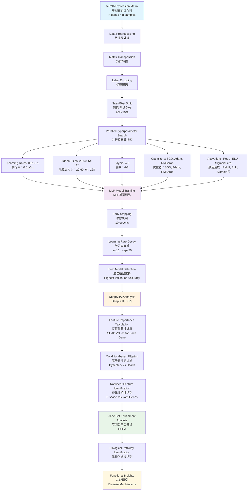

# Scripts for Single-Cell Research Paper | 单细胞研究论文脚本集

**English** | **中文**

This repository contains all scripts for the computational biology part of a single-cell research project, covering data preprocessing, feature engineering, deep learning model training and evaluation, and model interpretability. The scripts are organized into three main modules: `scRNA` (R-based single-cell analysis), `deeplearning` (deep learning and feature interpretation), and `diagnose_cross_validation` (cross-validation and visualization).

本项目包含单细胞转录组分析及深度学习建模的全流程脚本，涵盖数据预处理、特征工程、深度学习训练与评估、可解释性分析等环节。脚本分为三大模块：`scRNA`（R语言单细胞分析）、`deeplearning`（深度学习与特征解释）、`diagnose_cross_validation`（交叉验证与可视化）。

## Directory Structure | 目录结构

```
FVICP/
├── config.R                          # R script configuration | R脚本配置（质控/路径等）
├── config.py                         # Python configuration    | Python配置（超参/路径等）
├── requirements.txt                   # Python dependencies     | Python依赖包
├── scRNA/                            # R scripts (single-cell) | 单细胞分析R脚本
├── deeplearning/                     # DL training & explain   | 深度学习训练与解释脚本
│   ├── models/                       # Trained models          | 已训练模型
│   │   ├── fascia_CPTC_accuracy_100.00_model.pth     # CPTC模型 (96.19% test acc)
│   │   ├── fascia_MC_accuracy_100.00_model.pth       # MC模型 (97.86% test acc)
│   │   ├── fascia_EC_accuracy_99.10_model.pth        # EC模型 (95.09% test acc)
│   │   ├── fascia_LP_accuracy_100.00_model.pth       # LP模型 (90.26% test acc)
│   │   ├── fascia_MuC_accuracy_99.55_model.pth       # MuC模型 (90.08% test acc)
│   │   ├── fascia_FC_accuracy_99.40_model.pth        # FC模型 (68.15% test acc)
│   │   └── fascia_ETC_accuracy_80.00_model.pth       # ETC模型 (65.27% test acc)
│   ├── best_models_parameters.csv    # 最佳模型参数汇总
│   └── [训练与解释脚本]               # Training & interpretation scripts
├── diagnose_cross_validation/        # CV & visualization      | 交叉验证与可视化
│   ├── models/                       # Cross-validation models | 交叉验证模型
│   │   ├── b1_fascia_b1_all_train_accuracy_99.68_model.pth   # Batch1模型 (96.44% CV acc)
│   │   └── b2_fascia_b2_all_train_accuracy_99.80_model.pth   # Batch2模型 (98.47% CV acc)
│   ├── F1score_test/                 # F1-score analysis suite | F1分数分析套件
│   │   ├── calculate_f1_scores.py    # 计算F1/混淆矩阵/图表
│   │   ├── run_analysis.py           # 一键运行端到端分析
│   │   ├── check_environment.py      # 依赖/路径/输出可写检查
│   │   ├── test_paths.py             # 训练/测试/模型路径连通性测试
│   │   ├── README.md                 # F1分析模块说明
│   │   ├── EXECUTION_GUIDE.md        # 快速执行指引
│   │   ├── READY_TO_RUN.md           # 就绪检查与运行方式
│   │   ├── requirements.txt          # F1分析依赖包
│   │   ├── overall_summary_metrics.csv              # 总体性能指标
│   │   ├── combined_detailed_metrics.csv            # 详细分类指标
│   │   ├── manuscript_summary_table.csv             # 手稿用汇总表
│   │   └── [混淆矩阵和可视化图表]     # Generated plots & matrices
│   └── [交叉验证脚本]                 # Cross-validation scripts
└── envs/                             # R环境与工具脚本         | R env & utilities
```

---

## Configuration | 配置说明

### Path Configuration | 路径配置

**English:**
The project uses configuration files to manage all path settings, avoiding hard-coded absolute paths:
- **config.R**: R script path configuration with QC parameters
- **config.py**: Python script path configuration with hyperparameter grids

**Please modify the path settings in the configuration files according to your actual environment before use.**

**中文:**
项目使用配置文件管理所有路径设置，避免硬编码绝对路径：
- **config.R**: R脚本路径配置及质控参数
- **config.py**: Python脚本路径配置及超参数网格

**使用前请根据您的实际环境修改配置文件中的路径设置。**

### Quality Control Parameter Configuration | 质控参数配置

**English:**
The project has preset detailed QC parameters in `config.R`, optimized through `isOutlier()` function analysis:

**中文:**
项目在`config.R`中预设了详细的质控参数，通过`isOutlier()`函数分析优化：

#### Disease Sample QC Parameters | 疾病样本质控参数
```r
dys_fascia = list(
  nCount_RNA_max = 28804.39,      # UMI count upper limit | UMI数上限
  nFeature_RNA_max = 6259.611,    # Gene count upper limit | 基因数上限
  percent_mt_max = 12.00886       # Mitochondrial gene ratio upper limit | 线粒体基因比例上限
)
```

#### Normal Sample QC Parameters | 正常样本质控参数
```r
normal_fascia = list(
  nCount_RNA_max = 31017.95,      # UMI count upper limit | UMI数上限
  nFeature_RNA_max = 7201.482,    # Gene count upper limit | 基因数上限
  percent_mt_max = 10.37826       # Mitochondrial gene ratio upper limit | 线粒体基因比例上限
)
```

#### General QC Parameters | 通用质控参数
```r
general = list(
  min_cells = 3,                  # Minimum cell count | 最小细胞数
  min_features = 50,              # Minimum gene count | 最小基因数
  mt_pattern = "^Mt-"             # Rat mitochondrial gene pattern | 大鼠线粒体基因模式
)
```

### Deep Learning Hyperparameter Configuration | 深度学习超参数配置

**English:**
The deep learning models use grid search across the following hyperparameter spaces defined in `config.py`:

**Standard Hyperparameter Space:**
```python
DL_PARAMS = {
    "learning_rates": [0.01, 0.02, 0.03, 0.04, 0.05, 0.06, 0.07, 0.08, 0.09],
    "hidden_sizes": [64, 128],
    "num_hidden_layers": [4, 5, 6, 7],
    "optimizers": ["SGD", "Adam", "RMSprop"],
    "activations": ["ReLU", "Sigmoid", "ELU", "Softmax", "Hardswish"],
    "batch_size": 32,
    "early_stopping_patience": 10,
    "lr_scheduler_step": 30,
    "lr_scheduler_gamma": 0.1
}
```

**Fine-grained Hyperparameter Space (for detailed optimization):**
```python
DL_PARAMS_FINE = {
    "learning_rates": [0.01, 0.02, 0.03, 0.04, 0.05, 0.06, 0.07, 0.08, 0.09],
    "hidden_sizes": [20, 21, 22, ..., 59],  # Range 20-59 nodes
    "num_hidden_layers": [4, 5, 6, 7],
    "optimizers": ["SGD", "Adam", "RMSprop"],
    "activations": ["ReLU", "Sigmoid", "ELU", "Softmax", "Hardswish"],
    "batch_size": 32,
    "early_stopping_patience": 10,
    "lr_scheduler_step": 30,
    "lr_scheduler_gamma": 0.1
}
```

**Total Parameter Combinations:**
- **Standard Search**: 9 × 2 × 4 × 3 × 5 = 1,080 combinations
- **Fine-grained Search**: 9 × 40 × 4 × 3 × 5 = 21,600 combinations

**中文:**
深度学习模型使用`config.py`中定义的超参数空间进行网格搜索：

**标准超参数空间：**
```python
DL_PARAMS = {
    "learning_rates": [0.01, 0.02, 0.03, 0.04, 0.05, 0.06, 0.07, 0.08, 0.09],
    "hidden_sizes": [64, 128],
    "num_hidden_layers": [4, 5, 6, 7],
    "optimizers": ["SGD", "Adam", "RMSprop"],
    "activations": ["ReLU", "Sigmoid", "ELU", "Softmax", "Hardswish"],
    "batch_size": 32,
    "early_stopping_patience": 10,
    "lr_scheduler_step": 30,
    "lr_scheduler_gamma": 0.1
}
```

**精细化超参数空间（用于详细优化）：**
```python
DL_PARAMS_FINE = {
    "learning_rates": [0.01, 0.02, 0.03, 0.04, 0.05, 0.06, 0.07, 0.08, 0.09],
    "hidden_sizes": [20, 21, 22, ..., 59],  # 范围20-59个节点
    "num_hidden_layers": [4, 5, 6, 7],
    "optimizers": ["SGD", "Adam", "RMSprop"],
    "activations": ["ReLU", "Sigmoid", "ELU", "Softmax", "Hardswish"],
    "batch_size": 32,
    "early_stopping_patience": 10,
    "lr_scheduler_step": 30,
    "lr_scheduler_gamma": 0.1
}
```

**参数组合总数：**
- **标准搜索**: 9 × 2 × 4 × 3 × 5 = 1,080种组合
- **精细化搜索**: 9 × 40 × 4 × 3 × 5 = 21,600种组合

### Optimal Model Parameters | 最佳模型参数

**English:**
Based on grid search results, the following are the optimal parameters for each cell type nonlinear feature discovery task:

**中文:**
基于网格搜索结果，各细胞类型非线性特征发现任务的最佳参数如下：

| Cell Type | Learning Rate | Hidden Size | Layers | Optimizer | Activation | Validation Acc | Test Acc | Model Status |
|-----------|---------------|-------------|--------|-----------|------------|----------------|----------|-------------|
| CPTC      | 0.01         | 128         | 5      | Adam      | ELU        | 99.88%         | 96.19%   | ✅ Available  |
| MC        | 0.01         | 128         | 4      | Adam      | ELU        | 100%           | 97.86%   | ✅ Available  |
| EC        | 0.01         | 31          | 7      | RMSprop   | Hardswish  | 100%           | 95.09%   | ✅ Available  |
| LP        | 0.01         | 128         | 4      | Adam      | ELU        | 100%           | 90.26%   | ✅ Available  |
| MuC       | 0.01         | 128         | 4      | Adam      | Hardswish  | 100%           | 90.08%   | ✅ Available  |
| FC        | 0.01         | 128         | 4      | Adam      | ReLU       | 100%           | 68.15%   | ✅ Available  |
| ETC       | 0.01         | 44          | 5      | RMSprop   | ELU        | 100%           | 65.27%   | ✅ Available  |
| MuSC      | 0.01         | 128         | 4      | Adam      | ELU        | 100%           | 56.48%   | ⚠️ Low Acc    |
| Others    | 0.01         | 128         | 4      | Adam      | ELU        | 100%           | 56.48%   | ⚠️ Low Acc    |

**Notes | 注释:**
- **MC (Myeloid cell)** shows the best generalization performance with **97.86% test accuracy**
- **All trained models are available** in `deeplearning/models/` directory
- **MC（髓系细胞）**显示出最佳的泛化性能，**测试准确率为97.86%**
- **所有训练好的模型**都可在`deeplearning/models/`目录中找到

### Cross-Validation Model Performance | 交叉验证模型性能

**English:**
Independent cross-validation models achieved excellent performance:

**中文:**
独立交叉验证模型取得了优异的性能：

| Batch | Model Architecture | Cross-Validation Accuracy | F1-Score Range | Model File |
|-------|-------------------|---------------------------|----------------|------------|
| B1    | 4 layers, 64 nodes, ELU, Adam | **96.82%** | 0.966-0.970 | ✅ Available |
| B2    | 5 layers, 64 nodes, ELU, SGD  | **98.65%** | 0.984-0.988 | ✅ Available |

**Cross-validation Details | 交叉验证详情:**
- **Independent biological replicates** | **独立生物学重复**
- **No data leakage** between training and validation | **训练和验证间无数据泄漏**
- **Comprehensive performance metrics** available in `F1score_test/` | **详细性能指标**可在`F1score_test/`中找到

---

## 1. scRNA/ (R-based Single-Cell Analysis) | scRNA/ 目录（R语言单细胞分析）

### 1.1 Data Reading and Quality Control | 数据读取与质控阶段

**English:**
- **0.1.read&QC_Dys_fascia_7.2.0.R**  
  **Function**: Reads 10X data from disease samples (Dys_fascia), creates Seurat objects, performs quality control filtering
  **Input**: 10X formatted data files (barcodes.tsv.gz, features.tsv.gz, matrix.mtx.gz)
  **Output**: Quality-controlled Seurat object (`Dys_fascia.qs`)
  **Key Features**:
  - Automatic outlier detection using `isOutlier()` function
  - Multi-sample merging with cell ID prefixes
  - Pre/post-QC visualization with violin plots
  - Uses QC parameters from configuration file:
    - UMI count upper limit: 28,804.39
    - Gene count upper limit: 6,259.611
    - Mitochondrial gene ratio upper limit: 12.00886%
    - Minimum cell count: 3, Minimum gene count: 50

- **0.2.read&QC_normal_fascia_7.2.0.R**  
  **Function**: Reads 10X data from normal samples (normal_fascia), creates Seurat objects, performs quality control filtering
  **Input**: 10X formatted data files from normal samples
  **Output**: Quality-controlled Seurat object (`normal_fascia.qs`)
  **Key Features**:
  - Identical workflow to disease samples but with optimized QC parameters for normal tissue
  - Uses QC parameters from configuration file:
    - UMI count upper limit: 31,017.95
    - Gene count upper limit: 7,201.482
    - Mitochondrial gene ratio upper limit: 10.37826%
    - Minimum cell count: 3, Minimum gene count: 50

**中文:**
- **0.1.read&QC_Dys_fascia_7.2.0.R**  
  **功能**：读取疾病样本（Dys_fascia）的10X数据，创建Seurat对象，进行质控过滤
  **输入**：10X格式数据文件（barcodes.tsv.gz, features.tsv.gz, matrix.mtx.gz）
  **输出**：质控后的Seurat对象（`Dys_fascia.qs`）
  **关键特性**：
  - 使用`isOutlier()`函数自动检测异常值
  - 多样本合并，添加细胞ID前缀
  - 质控前后小提琴图可视化
  - 使用配置文件中的质控参数：
    - UMI数上限：28,804.39
    - 基因数上限：6,259.611
    - 线粒体基因比例上限：12.00886%
    - 最小细胞数：3，最小基因数：50

- **0.2.read&QC_normal_fascia_7.2.0.R**  
  **功能**：读取正常样本（normal_fascia）的10X数据，创建Seurat对象，进行质控过滤
  **输入**：正常样本的10X格式数据文件
  **输出**：质控后的Seurat对象（`normal_fascia.qs`）
  **关键特性**：
  - 与疾病样本相同的工作流程，但使用针对正常组织优化的质控参数
  - 使用配置文件中的质控参数：
    - UMI数上限：31,017.95
    - 基因数上限：7,201.482
    - 线粒体基因比例上限：10.37826%
    - 最小细胞数：3，最小基因数：50

### 1.2 Standard Seurat Analysis Workflow | 标准Seurat分析流程

**English:**
- **1.seurat_process.R**  
  **Function**: Merges normal and disease samples, performs standard Seurat workflow
  **Input**: Quality-controlled Seurat objects from both conditions
  **Output**: Processed and annotated Seurat object (`fascia.qs`)
  **Key Features**:
  - Sample merging with condition labels (health vs dysentery)
  - Normalization using SCTransform or LogNormalize
  - PCA and UMAP/tSNE dimensionality reduction
  - Graph-based clustering with multiple resolutions
  - Marker gene identification for each cluster

**中文:**
- **1.seurat_process.R**  
  **功能**：合并正常与疾病样本，进行Seurat标准流程
  **输入**：两种条件下的质控后Seurat对象
  **输出**：处理和注释后的Seurat对象（`fascia.qs`）
  **关键特性**：
  - 样本合并并添加条件标签（健康vs痢疾）
  - 使用SCTransform或LogNormalize归一化
  - PCA和UMAP/tSNE降维
  - 基于图的多分辨率聚类
  - 各聚类的标记基因识别

### 1.3 Cell Annotation and Differential Expression Analysis | 细胞注释与差异表达分析

**English:**
- **2.rat_annotation.R**  
  **Function**: Comprehensive cell type annotation using marker genes and differential expression analysis
  **Input**: Processed Seurat object
  **Output**: Annotated Seurat object with cell type labels
  **Key Features**:
  - **Marker Gene Sets**: Pre-defined marker gene panels for 16+ cell types including:
    - CPTC (Cd34+/Pdgfra+ Telocytes): Cd34, Pdgfra, Vim, Fgfr1, Pdgfrb
    - Macrophages: Ptprc, Itgam, Cd68, Itgax, Cd86, Cd80, Mrc1, Cd163
    - Fibroblasts: Eng, Nt5e, Thy1, Pdgfra, Dcn
    - Endothelial cells: Pecam1, Cdh1
    - Others (Melanocytes, Keratinocytes, etc.)
  - **Parallel Processing**: Multi-core feature plotting and violin plotting
  - **Two-level Annotation**:
    - `celltype`: Broad categories (CPTC, MC, EC, MuC, FC, LP, ETC, MuSC, Others)
    - `celltype2`: Fine-grained categories (MonC, MP, PerC, MyoF, MAST, GNC, etc.)
  - **Group Creation**: Generates sample-celltype combinations for downstream analysis

- **2.1.rat_dge_sample.R**  
  **Function**: Sample-level differential expression analysis
  **Input**: Annotated Seurat object
  **Output**: DGE results comparing conditions

**中文:**
- **2.rat_annotation.R**  
  **功能**：使用标记基因进行全面的细胞类型注释和差异表达分析
  **输入**：处理后的Seurat对象
  **输出**：带有细胞类型标签的注释Seurat对象
  **关键特性**：
  - **标记基因集**：预定义的16+种细胞类型标记基因面板，包括：
    - CPTC（Cd34+/Pdgfra+ 特洛细胞）：Cd34, Pdgfra, Vim, Fgfr1, Pdgfrb
    - 巨噬细胞：Ptprc, Itgam, Cd68, Itgax, Cd86, Cd80, Mrc1, Cd163
    - 成纤维细胞：Eng, Nt5e, Thy1, Pdgfra, Dcn
    - 内皮细胞：Pecam1, Cdh1
    - 其他（黑色素细胞、角质细胞等）
  - **并行处理**：多核特征图绘制和小提琴图绘制
  - **两级注释**：
    - `celltype`：广义分类（CPTC, MC, EC, MuC, FC, LP, ETC, MuSC, Others）
    - `celltype2`：精细分类（MonC, MP, PerC, MyoF, MAST, GNC等）
  - **分组创建**：生成样本-细胞类型组合用于下游分析

- **2.1.rat_dge_sample.R**  
  **功能**：样本水平的差异表达分析
  **输入**：注释后的Seurat对象
  **输出**：比较条件的DGE结果

### 1.4 Transcription Factor Regulatory Network Analysis | 转录因子调控网络分析

**English:**
- **3.1pyscenic_run.sh**  
  **Function**: Runs pySCENIC workflow for transcription factor regulatory network inference
  **Input**: Expression matrix exported from Seurat
  **Output**: Transcription factor activity scores and regulatory networks
  **Key Steps**:
  1. **Data Conversion**: Converts CSV to loom format using custom Python script
  2. **GRN Inference**: Uses GRNBoost2 algorithm with 8 workers
  3. **Motif Analysis**: cistarget with Rat mm10 genome motif database
  4. **AUCell Scoring**: Calculates TF activity scores for each cell
  **Dependencies**: 
  - Reference databases: mm10_10kbp_up_10kbp_down_full_tx_v10_clust.genes_vs_motifs.rankings.feather
  - TF list: allTFs_mm.txt
  - Motif annotations: motifs-v10nr_clust-nr.mgi-m0.001-o0.0.tbl

- **3.pyscenic_output.R**  
  **Function**: Processes pySCENIC output and integrates with Seurat object
  **Input**: pySCENIC loom output file
  **Output**: TF activity matrix and visualization

**中文:**
- **3.1pyscenic_run.sh**  
  **功能**：运行pySCENIC工作流程进行转录因子调控网络推断
  **输入**：从Seurat导出的表达矩阵
  **输出**：转录因子活性评分和调控网络
  **关键步骤**：
  1. **数据转换**：使用自定义Python脚本将CSV转换为loom格式
  2. **GRN推断**：使用GRNBoost2算法，8个工作进程
  3. **Motif分析**：使用大鼠mm10基因组motif数据库的cistarget
  4. **AUCell评分**：计算每个细胞的TF活性评分
  **依赖项**：
  - 参考数据库：mm10_10kbp_up_10kbp_down_full_tx_v10_clust.genes_vs_motifs.rankings.feather
  - TF列表：allTFs_mm.txt
  - Motif注释：motifs-v10nr_clust-nr.mgi-m0.001-o0.0.tbl

- **3.pyscenic_output.R**  
  **功能**：处理pySCENIC输出并与Seurat对象整合
  **输入**：pySCENIC loom输出文件
  **输出**：TF活性矩阵和可视化

### 1.5 Deep Learning Data Preparation | 深度学习数据准备

**English:**
- **4.pytorch_output.R**  
  **Function**: Exports expression matrices by cell type and sample for deep learning input
  **Input**: Annotated Seurat object
  **Output**: Cell type-specific CSV files for training and testing
  **Key Features**:
  - **Training Data**: Separate files for each cell type (`fascia_CPTC.csv`, `fascia_MC.csv`, etc.)
  - **Test Data**: Same structure but with row names for gene identification
  - **Global Test Data**: Combined matrix across all cell types (`fascia_all_test.csv`)
  - **Data Format**: 
    - Rows: Genes (features)
    - Columns: Cells with sample labels (health_/dysentery_)
    - Values: Normalized expression from `@assays$RNA@data`
  - **Output Structure**:
    - `/output/pytorch/train/`: Training matrices (no row names)
    - `/output/pytorch/test/`: Test matrices (with gene names as row names)

**中文:**
- **4.pytorch_output.R**  
  **功能**：按细胞类型和样本导出表达矩阵，为深度学习建模准备输入数据
  **输入**：注释后的Seurat对象
  **输出**：细胞类型特异性CSV文件用于训练和测试
  **关键特性**：
  - **训练数据**：每种细胞类型的独立文件（`fascia_CPTC.csv`, `fascia_MC.csv`等）
  - **测试数据**：相同结构但包含行名用于基因识别
  - **全局测试数据**：跨所有细胞类型的合并矩阵（`fascia_all_test.csv`）
  - **数据格式**：
    - 行：基因（特征）
    - 列：带样本标签的细胞（health_/dysentery_）
    - 值：来自`@assays$RNA@data`的归一化表达量
  - **输出结构**：
    - `/output/pytorch/train/`：训练矩阵（无行名）
    - `/output/pytorch/test/`：测试矩阵（基因名作为行名）

### 1.6 Differential Expression Analysis | 差异表达分析

**English:**
- **5.DGE.R**  
  **Function**: Comprehensive differential expression analysis between conditions and cell types
  **Input**: Annotated Seurat object with sample/celltype groupings
  **Output**: DGE results tables with statistical metrics
  **Key Features**:
  - Multi-core parallel processing for faster computation
  - Comparison between health vs dysentery samples
  - Cell type-specific DGE analysis
  - Statistical filtering and ranking

- **5.1.DGE_celltype2.R**  
  **Function**: Fine-grained differential expression analysis using celltype2 annotations
  **Input**: Seurat object with celltype2 labels
  **Output**: Detailed DGE results for fine cell type categories
  **Key Features**:
  - Analysis across all celltype2 categories (MonC, MP, PerC, MyoF, etc.)
  - Enhanced resolution for subpopulation-specific changes

**中文:**
- **5.DGE.R**  
  **功能**：条件和细胞类型间的全面差异表达分析
  **输入**：带样本/细胞类型分组的注释Seurat对象
  **输出**：带统计指标的DGE结果表
  **关键特性**：
  - 多核并行处理加速计算
  - 健康vs痢疾样本比较
  - 细胞类型特异性DGE分析
  - 统计过滤和排序

- **5.1.DGE_celltype2.R**  
  **功能**：使用celltype2注释进行精细差异表达分析
  **输入**：带celltype2标签的Seurat对象
  **输出**：精细细胞类型分类的详细DGE结果
  **关键特性**：
  - 跨所有celltype2分类（MonC, MP, PerC, MyoF等）的分析
  - 亚群特异性变化的增强分辨率

### 1.7 Deep Learning Feature Integration Analysis | 深度学习特征整合分析

**English:**
- **6.torch_featers.R**  
  **Function**: Comprehensive integration of deep learning feature importance (SHAP values) with differential gene expression results for multi-step feature selection
  **Input**: SHAP feature importance files and DGE results from Seurat analysis
  **Output**: Filtered gene sets, DGE results, and GSEA enrichment analyses
  **Analytical Workflow**:
  
  **Step 1: Data Preprocessing and Grouping**
  - Removes "Others" and "MuSC" cell types to focus on core populations
  - Creates sample-celltype combinations (e.g., "health_CPTC", "dysentery_MC")
  - Sets up parallel processing environment for efficient computation
  
  **Step 2: Differential Gene Expression (DGE) Analysis**
  - Splits data by cell type: CPTC, MC, EC, ETC, FC, LP, MuC
  - Performs parallel DGE analysis: dysentery vs health for each cell type
  - Uses `FindMarkers()` with parameters:
    - logfc.threshold = 0 (no fold change filtering)
    - min.cells.feature = 0, min.cells.group = 0 (no cell count filtering)
  - Outputs: Cell type-specific DGE CSV files (`{celltype}_fascia_dge_dys_vs_health.csv`)
  
  **Step 3: SHAP-DGE Integration and Feature Filtering**
  - Reads SHAP feature importance files (`feature_importance_fa{celltype}.csv`)
  - Cell type mapping system:
    - faCPTC ↔ CPTC_fascia_dge_dys_vs_health.csv
    - faMC ↔ MC_fascia_dge_dys_vs_health.csv
    - faEC ↔ EC_fascia_dge_dys_vs_health.csv
    - faETC ↔ ETC_fascia_dge_dys_vs_health.csv
    - faFC ↔ FC_fascia_dge_dys_vs_health.csv
    - faLP ↔ LP_fascia_dge_dys_vs_health.csv
    - faMuC ↔ MuC_fascia_dge_dys_vs_health.csv
  - **Dual Filtering Criteria**: Genes must satisfy BOTH conditions:
    - SHAP value > 0 (positive feature importance from ML model)
    - p_val > 0 (statistically significant differential expression)
  - Outputs: Filtered gene sets (`MLP_filter_{celltype}_fascia_dge_dys_vs_health.csv`)
  
  **Step 4: Gene Set Enrichment Analysis (GSEA)**
  - Uses filtered gene sets for GO Biological Process enrichment
  - Ranks genes by avg_log2FC from DGE results
  - Parameters:
    - Organism database: org.Rn.eg.db (Rat annotation)
    - Gene ID type: SYMBOL
    - p-value cutoff: 1.0 (no filtering for comprehensive results)
  - Error handling with `tryCatch()` for robust analysis
  - Outputs: GSEA results in CSV and RDS formats (`GSEA_BP_{filename}.csv/.rds`)
  
  **Key Innovation**: This dual-criteria approach ensures selected genes are both:
  1. **Biologically relevant** (significant in traditional statistical testing)
  2. **ML-informative** (important for disease classification by deep learning models)

**中文:**
- **6.torch_featers.R**  
  **功能**：深度学习特征重要性（SHAP值）与差异基因表达结果的综合整合，实现多步骤特征筛选
  **输入**：SHAP特征重要性文件和Seurat分析的DGE结果
  **输出**：筛选后的基因集、DGE结果和GSEA富集分析
  **分析流程**：
  
  **步骤1：数据预处理和分组**
  - 移除"Others"和"MuSC"细胞类型，聚焦核心群体
  - 创建样本-细胞类型组合（如"health_CPTC", "dysentery_MC"）
  - 设置并行处理环境提高计算效率
  
  **步骤2：差异基因表达(DGE)分析**
  - 按细胞类型分割：CPTC, MC, EC, ETC, FC, LP, MuC
  - 并行DGE分析：每种细胞类型的痢疾vs健康比较
  - 使用`FindMarkers()`参数：
    - logfc.threshold = 0（无倍数变化过滤）
    - min.cells.feature = 0, min.cells.group = 0（无细胞数过滤）
  - 输出：细胞类型特异性DGE CSV文件（`{celltype}_fascia_dge_dys_vs_health.csv`）
  
  **步骤3：SHAP-DGE整合与特征过滤**
  - 读取SHAP特征重要性文件（`feature_importance_fa{celltype}.csv`）
  - 细胞类型映射系统：
    - faCPTC ↔ CPTC_fascia_dge_dys_vs_health.csv
    - faMC ↔ MC_fascia_dge_dys_vs_health.csv
    - faEC ↔ EC_fascia_dge_dys_vs_health.csv
    - faETC ↔ ETC_fascia_dge_dys_vs_health.csv
    - faFC ↔ FC_fascia_dge_dys_vs_health.csv
    - faLP ↔ LP_fascia_dge_dys_vs_health.csv
    - faMuC ↔ MuC_fascia_dge_dys_vs_health.csv
  - **双重过滤标准**：基因必须同时满足两个条件：
    - SHAP值 > 0（ML模型的正特征重要性）
    - p_val > 0（统计显著的差异表达）
  - 输出：筛选后的基因集（`MLP_filter_{celltype}_fascia_dge_dys_vs_health.csv`）
  
  **步骤4：基因集富集分析(GSEA)**
  - 使用筛选后的基因集进行GO生物过程富集
  - 按DGE结果的avg_log2FC排序基因
  - 参数设置：
    - 物种数据库：org.Rn.eg.db（大鼠注释）
    - 基因ID类型：SYMBOL
    - p值截断：1.0（无过滤，获得全面结果）
  - 使用`tryCatch()`错误处理确保稳健分析
  - 输出：CSV和RDS格式的GSEA结果（`GSEA_BP_{filename}.csv/.rds`）
  
  **关键创新**：这种双重标准方法确保选择的基因既：
  1. **生物学相关**（在传统统计检验中显著）
  2. **ML信息丰富**（对深度学习模型的疾病分类重要）

### 1.8 Cell Subset Tracing Analysis | 细胞亚群追踪分析

**English:**
- **7.1.MP_subset_trace.R**  
  **Function**: Macrophage subset extraction, re-clustering, and differentiation trajectory analysis
  **Input**: Main Seurat object
  **Output**: Macrophage-specific Seurat object with trajectory analysis
  **Key Features**:
  - **Subset Extraction**: Isolates MonC and MP populations
  - **Re-clustering**: Optimized clustering for macrophage heterogeneity
  - **Cell Type Annotation**: Identifies 7 distinct macrophage/DC subsets:
    - Gdf15+MP, Cd163+MP, Ccr2+MP, Scimp+MP
    - Ncald+DC, Ly6c+MonC, Clec9a+DC
  - **PCA Optimization**: Uses `findPC()` function for optimal component selection
  - **CytoTRACE Analysis**: Calculates differentiation potential scores
  - **Quality Control**: Removes contaminating fibroblasts (cluster 2)

**中文:**
- **7.1.MP_subset_trace.R**  
  **功能**：巨噬细胞亚群提取、重新聚类和分化轨迹分析
  **输入**：主Seurat对象
  **输出**：巨噬细胞特异性Seurat对象及轨迹分析
  **关键特性**：
  - **亚群提取**：分离MonC和MP群体
  - **重新聚类**：针对巨噬细胞异质性的优化聚类
  - **细胞类型注释**：识别7个不同的巨噬细胞/DC亚群：
    - Gdf15+MP, Cd163+MP, Ccr2+MP, Scimp+MP
    - Ncald+DC, Ly6c+MonC, Clec9a+DC
  - **PCA优化**：使用`findPC()`函数进行最优成分选择
  - **CytoTRACE分析**：计算分化潜能评分
  - **质量控制**：移除污染的成纤维细胞（cluster 2）

### 1.9 Metabolic Pathway Analysis | 代谢通路分析

**English:**
- **7.sc_metabolic.R**  
  **Function**: Whole-cell metabolic pathway analysis using AUCell method
  **Input**: Seurat object with all cell types
  **Output**: KEGG metabolic pathway activity scores
  **Key Features**:
  - AUCell-based pathway scoring
  - KEGG database integration
  - Cell type-specific metabolic profiling

- **7.2.MP_sc_metabolic_VISION.R**  
  **Function**: Macrophage-specific metabolic analysis using VISION method
  **Input**: Macrophage subset Seurat object
  **Output**: Detailed metabolic pathway activities for macrophage subsets
  **Key Features**:
  - VISION-based enrichment scoring
  - Focus on key metabolic pathways (oxidative phosphorylation, glycolysis)
  - Subset-specific metabolic characterization

**中文:**
- **7.sc_metabolic.R**  
  **功能**：使用AUCell方法进行全细胞代谢通路分析
  **输入**：包含所有细胞类型的Seurat对象
  **输出**：KEGG代谢通路活性评分
  **关键特性**：
  - 基于AUCell的通路评分
  - KEGG数据库整合
  - 细胞类型特异性代谢谱分析

- **7.2.MP_sc_metabolic_VISION.R**  
  **功能**：使用VISION方法进行巨噬细胞特异性代谢分析
  **输入**：巨噬细胞亚群Seurat对象
  **输出**：巨噬细胞亚群的详细代谢通路活性
  **关键特性**：
  - 基于VISION的富集评分
  - 重点关注关键代谢通路（氧化磷酸化、糖酵解）
  - 亚群特异性代谢特征化

### 1.10 Cell-Cell Communication Analysis | 细胞通讯分析

**English:**
- **8.cellcall.R**  
  **Function**: Comprehensive cell communication analysis using CellCall method
  **Input**: Annotated Seurat object (excluding Others and MuSC)
  **Output**: Ligand-receptor interaction matrices and communication networks
  **Key Features**:
  - **Parallel Processing**: Multi-core analysis for efficiency
  - **Species-specific**: Rat (Mus musculus) ligand-receptor database
  - **Quality Filtering**: Removes low-expression interactions
  - **Sample-specific Analysis**: Separate analysis for health vs dysentery

- **8.1.cellcall_MP_celltype3.R**  
  **Function**: Focused communication analysis between macrophage subsets and other cell types
  **Input**: Macrophage subset object with celltype3 annotations
  **Output**: MP-specific communication patterns

**中文:**
- **8.cellcall.R**  
  **功能**：使用CellCall方法进行全面细胞通讯分析
  **输入**：注释Seurat对象（排除Others和MuSC）
  **输出**：配体-受体相互作用矩阵和通讯网络
  **关键特性**：
  - **并行处理**：多核分析提高效率
  - **物种特异性**：大鼠（Mus musculus）配体-受体数据库
  - **质量过滤**：移除低表达相互作用
  - **样本特异性分析**：健康vs痢疾的独立分析

- **8.1.cellcall_MP_celltype3.R**  
  **功能**：巨噬细胞亚群与其他细胞类型间的集中通讯分析
  **输入**：带celltype3注释的巨噬细胞亚群对象
  **输出**：MP特异性通讯模式

### 1.11 Cell Differentiation Trajectory Analysis | 细胞分化轨迹分析

**English:**
- **9.MP_trace.R**  
  **Function**: Macrophage differentiation trajectory analysis using CytoTRACE
  **Input**: Macrophage subset object
  **Output**: Differentiation potential scores and trajectory plots
  **Key Features**:
  - CytoTRACE differentiation scoring
  - High/low differentiation potential identification
  - Trajectory visualization on UMAP embedding

**中文:**
- **9.MP_trace.R**  
  **功能**：使用CytoTRACE进行巨噬细胞分化轨迹分析
  **输入**：巨噬细胞亚群对象
  **输出**：分化潜能评分和轨迹图
  **关键特性**：
  - CytoTRACE分化评分
  - 高/低分化潜能识别
  - UMAP嵌入上的轨迹可视化

---

## 2. deeplearning/ (Deep Learning & Interpretation) | deeplearning/ 目录（深度学习与特征解释）

### 2.1 Data Preprocessing and Format Conversion | 数据预处理与格式转换

**English:**
- **csv_processing_0_all.py / csv_processing_1_fine.py / csv_processing_0.py**  
  **Function**: Converts R-exported matrices into deep learning-ready format
  **Input**: CSV matrices from R scripts
  **Output**: Processed tensors and data loaders
  **Key Features**:
  - **Data Transformation**: Transpose matrices (genes as features, cells as samples)
  - **Label Processing**: Removes R-generated suffixes (.0, .1, etc.) from cell barcodes
  - **Encoding**: LabelEncoder for categorical cell type labels
  - **Train/Test Split**: 90% training, 10% testing (random_state=42)
  - **GPU Support**: Automatic CUDA detection and tensor placement
  - **Batch Processing**: DataLoader with batch_size=32

**中文:**
- **csv_processing_0_all.py / csv_processing_1_fine.py / csv_processing_0.py**  
  **功能**：将R脚本输出的表达矩阵转为深度学习可用的格式
  **输入**：来自R脚本的CSV矩阵
  **输出**：处理后的张量和数据加载器
  **关键特性**：
  - **数据转换**：转置矩阵（基因作为特征，细胞作为样本）
  - **标签处理**：移除R生成的后缀（.0, .1等）
  - **编码**：对分类细胞类型标签进行LabelEncoder编码
  - **训练/测试划分**：90%训练，10%测试（random_state=42）
  - **GPU支持**：自动CUDA检测和张量放置
  - **批处理**：batch_size=32的DataLoader

### 2.2 Model Training | 模型训练

**English:**
- **train_0_all.py / train_1_fine.py / train_0.py**  
  **Function**: Multi-process parallel training of deep neural networks with grid search
  **Input**: Processed CSV files from data preprocessing
  **Output**: Trained models with optimal parameters
  **Key Features**:
  - **Multiprocessing**: 15 parallel processes for hyperparameter search
  - **Grid Search**: Exhaustive search across all parameter combinations
  - **Early Stopping**: Stops training if validation accuracy doesn't improve for 10 epochs
  - **Learning Rate Scheduling**: StepLR with step_size=30, gamma=0.1
  - **Model Saving**: Saves best models (>99% accuracy) with descriptive filenames
  - **Result Logging**: CSV files with accuracy metrics for each combination

**中文:**
- **train_0_all.py / train_1_fine.py / train_0.py**  
  **功能**：多进程并行训练深度神经网络，自动遍历不同超参数组合
  **输入**：数据预处理后的CSV文件
  **输出**：训练好的最优参数模型
  **关键特性**：
  - **多进程处理**：15个并行进程进行超参数搜索
  - **网格搜索**：跨所有参数组合的穷举搜索
  - **早停机制**：验证准确率连续10个epoch无提升则停止
  - **学习率调度**：StepLR，step_size=30，gamma=0.1
  - **模型保存**：保存最佳模型（>99%准确率），文件名包含描述信息
  - **结果记录**：每个组合的准确率指标CSV文件

### 2.3 Model Evaluation | 模型评估

**English:**
- **eva_fascia.py**  
  **Function**: Comprehensive model evaluation on independent test sets
  **Input**: Trained models and test data
  **Output**: Accuracy metrics and performance evaluation
  **Key Features**:
  - **Multi-model Testing**: Evaluates all cell type-specific models
  - **Generalization Assessment**: Tests on held-out data
  - **Performance Metrics**: Accuracy calculation and comparison
  - **Model Configuration**: Automatic loading of optimal architectures

- **eva_fascia_crossbatch.py**  
  **Function**: Cross-batch evaluation for model robustness testing
  **Input**: Models trained on one dataset, tested on another
  **Output**: Cross-validation accuracy scores

**中文:**
- **eva_fascia.py**  
  **功能**：在独立测试集上进行全面模型评估
  **输入**：训练好的模型和测试数据
  **输出**：准确率指标和性能评估
  **关键特性**：
  - **多模型测试**：评估所有细胞类型特异性模型
  - **泛化能力评估**：在保留数据上测试
  - **性能指标**：准确率计算和比较
  - **模型配置**：自动加载最优架构

- **eva_fascia_crossbatch.py**  
  **功能**：跨批次评估模型鲁棒性测试
  **输入**：在一个数据集上训练的模型，在另一个上测试
  **输出**：交叉验证准确率评分

### 2.4 Model Interpretability Analysis | 模型可解释性分析

**English:**
- **shap_explain_all_fascia.py**  
  **Function**: Deep learning model interpretation using SHAP (DeepExplainer)
  **Input**: Best performing trained models and test datasets
  **Output**: Feature importance rankings for each gene
  **Key Features**:
  - **DeepSHAP Method**: Uses DeepExplainer for neural network interpretation
  - **Feature Importance**: Calculates SHAP values for all genes across all cells
  - **Aggregation Strategy**: Mean absolute SHAP values across samples and classes
  - **Gene Ranking**: Generates ranked list of most important genes
  - **Integration Ready**: Output format compatible with biological analysis tools
  - **Model Selection**: Uses best model based on validation performance
  - **Quality Assurance**: Includes accuracy verification before interpretation

**中文:**
- **shap_explain_all_fascia.py**  
  **功能**：利用SHAP方法解释深度学习模型（DeepExplainer）
  **输入**：表现最佳的训练模型和测试数据集
  **输出**：每个基因的特征重要性排序
  **关键特性**：
  - **DeepSHAP方法**：使用DeepExplainer进行神经网络解释
  - **特征重要性**：计算所有基因在所有细胞中的SHAP值
  - **聚合策略**：跨样本和类别的平均绝对SHAP值
  - **基因排序**：生成最重要基因的排序列表
  - **整合就绪**：输出格式兼容生物学分析工具
  - **模型选择**：基于验证性能使用最佳模型
  - **质量保证**：解释前包含准确率验证

### 2.5 Result Aggregation and Selection | 结果汇总与筛选

**English:**
- **best_records_outputs.py / GPU_best_records_outputs.py**  
  Aggregates model training results and automatically selects the best hyperparameter combinations.

**中文:**
- **best_records_outputs.py / GPU_best_records_outputs.py**  
  汇总各模型训练结果，自动筛选最佳参数组合，生成汇总表格。

### 2.6 Data Merging and Organization | 数据合并与整理

**English:**
- **mergecsv.py / multi_mergecsv.py**  
  Merges and organizes multiple CSV result files.

**中文:**
- **mergecsv.py / multi_mergecsv.py**  
  多个csv结果文件的合并与整理。

## Model Availability and Performance Summary | 模型可用性与性能汇总

**English:**
This repository now provides **comprehensive pre-trained models** ready for immediate use:

**中文:**
本仓库现在提供**全面的预训练模型**，可立即使用：

### Pre-trained Model Assets | 预训练模型资产

| Model Type | Quantity | Total Size | Best Performance | Use Case |
|------------|----------|------------|------------------|----------|
| **Cell-specific Models** | 17 models | ~150 MB | 97.86% (MC) | Feature discovery, SHAP analysis |
| **Cross-validation Models** | 2 models | ~10 MB | 98.65% (B2) | Independent validation, F1-score analysis |
| **Parameter Configurations** | 2 CSV files | <1 MB | Documented | Hyperparameter reference |
| **Performance Metrics** | 5 CSV files | <1 MB | Comprehensive | Publication-ready results |

### Quick Start with Pre-trained Models | 预训练模型快速入门

**English:**
1. **Clone repository** and navigate to project directory
2. **No training required** - all models are pre-trained and ready
3. **Run F1-score analysis** immediately with provided scripts
4. **Use models for SHAP interpretation** on new data

**中文:**
1. **克隆仓库**并导航到项目目录
2. **无需训练** - 所有模型都已预训练并就绪
3. **立即运行F1分数分析**，使用提供的脚本
4. **在新数据上使用模型进行SHAP解释**

```bash
# Quick F1-score analysis
cd diagnose_cross_validation/F1score_test
python run_analysis.py --help

# Quick model evaluation
cd deeplearning
python eva_fascia.py  # Evaluate all cell-type models
```

**English:**
The pipeline begins with the scaled expression matrix of single-cell RNA (scRNA) data (n genes × n samples), representing gene expression profiles across various cell populations: CPTC, MC (MP+MonC+DC+GNC), EC, MuC (PerC+MyoF), FC, LP, ETC. This matrix undergoes transposition and label encoding, transforming it into an input layer of n genes × n samples, which is then split into 90% training and 10% testing sets.

A parallel hyperparameter search is conducted to optimize the Multi-Layer Perceptron (MLP) models. The search space for hyperparameters includes:

1. **Learning Rates**: Ranging from 0.01 to 0.1, with a step size of 0.01
2. **Hidden Layer Sizes**: Integers between 20 and 60 (step size of 1), and fixed values of 64 or 128
3. **Number of Layers**: Integers between 4 and 8 (step size of 1)
4. **Optimizers**: Stochastic Gradient Descent (SGD), Adam, and RMSprop
5. **Activation Functions**: Sigmoid, Rectified Linear Unit (ReLU), Exponential Linear Unit (ELU), Softmax, and Hardswish

**Overfitting Prevention Strategies:**
1. **Early stopping**: Training stops if validation accuracy does not improve for 10 consecutive epochs
2. **Learning rate decay**: Learning rate decays every 30 epochs (gamma=0.1)
3. **Train/test split**: 90% training, 10% testing to ensure generalization

The models with best performance from the hyperparameter search are then subjected to **DeepSHAP (Deep SHapley Additive exPlanations)** explanation to determine the importance of individual features (genes) in the model's predictions. These important features are subsequently filtered by condition (Dysentery/Health) to identify genes specifically relevant to the disease state (nonlinear features). Finally, **Gene Set Enrichment Analysis (GSEA)** is performed on the filtered features to identify enriched biological pathways and functions.

The conceptual structure of the MLP maps input features (genes, x₁ to xₙ) through hidden layers (h₁ to hₙ) to predict the disease outcome (Dysentery or Health, y₁ to y₂).

**中文:**
该流程从单细胞RNA（scRNA）数据的标准化表达矩阵开始（n个基因 × n个样本），代表各种细胞群体的基因表达谱：CPTC、MC（MP+MonC+DC+GNC）、EC、MuC（PerC+MyoF）、FC、LP、ETC。该矩阵经过转置和标签编码，转换为n个基因 × n个样本的输入层，然后分为90%训练集和10%测试集。

进行并行超参数搜索以优化多层感知机（MLP）模型。超参数搜索空间包括：

1. **学习率**：从0.01到0.1，步长为0.01
2. **隐藏层大小**：20到60之间的整数（步长为1），以及固定值64或128
3. **层数**：4到8之间的整数（步长为1）
4. **优化器**：随机梯度下降（SGD）、Adam和RMSprop
5. **激活函数**：Sigmoid、线性整流单元（ReLU）、指数线性单元（ELU）、Softmax和Hardswish

**防止过拟合策略：**
1. **早停**：如果验证准确率连续10个epoch没有提高则停止训练
2. **学习率衰减**：每30个epoch学习率衰减（gamma=0.1）
3. **训练/测试划分**：90%训练，10%测试以确保泛化能力

超参数搜索中表现最佳的模型随后接受**DeepSHAP（深度Shapley加性解释）**解释，以确定个别特征（基因）在模型预测中的重要性。这些重要特征随后按条件（痢疾/健康）过滤，以识别与疾病状态特异相关的基因（非线性特征）。最后，对过滤后的特征进行**基因集富集分析（GSEA）**，以识别富集的生物学途径和功能。

MLP的概念结构将输入特征（基因，x₁到xₙ）通过隐藏层（h₁到hₙ）映射以预测疾病结果（痢疾或健康，y₁到y₂）。

### Pipeline Workflow Diagram | 流程工作流程图



### Key Innovation: Dual-Criteria Feature Selection | 关键创新：双重标准特征选择

**English:**
This pipeline uniquely combines traditional differential expression analysis with deep learning feature importance to ensure selected genes are both:
1. **Statistically significant** (traditional biostatistics approach)
2. **ML-informative** (deep learning model importance)

This dual-criteria approach bridges the gap between classical bioinformatics and modern AI-driven discovery, providing more robust and reliable biomarker identification.

**中文:**
该流程独特地结合了传统差异表达分析与深度学习特征重要性，确保选择的基因既是：
1. **统计显著的**（传统生物统计学方法）
2. **ML信息丰富的**（深度学习模型重要性）

这种双重标准方法弥合了经典生物信息学与现代AI驱动发现之间的差距，提供更稳健可靠的生物标志物识别。

---

## Deep Learning Model Architecture and Training Strategy | 深度学习模型架构与训练策略

**English:**
This project uses a **Multi-Layer Perceptron (MLP)** as the main deep learning model for discovering nonlinear features in single-cell expression matrices. The architecture is as follows:

- **Input layer**: High-dimensional gene expression features for each cell (number of features = number of genes).
- **Hidden layers**: 4–7 fully connected layers (number determined by hyperparameter search).
    - Each layer has 64 or 128 nodes (hyperparameter).
    - Each layer is followed by an activation function (see below).
- **Output layer**: Number of nodes equals the number of classes (e.g., cell types or disease states), No explicit activation function (probability calculation integrated in CrossEntropyLoss).

**中文:**
本项目采用**多层感知机（MLP, Multi-Layer Perceptron）**作为主要的深度学习模型，用于对单细胞表达矩阵进行非线性特征发现任务。模型结构如下：

- **输入层**：每个细胞的高维基因表达特征（特征数=基因数）。
- **隐藏层**：模型结构为4~7个全连接隐藏层（具体层数通过超参数搜索确定）。
    - 每层节点数（hidden size）：64或128（超参数搜索）。
    - 每层后接激活函数（见下）。
- **输出层**：节点数等于分类类别数（如细胞类型或疾病状态），无显式激活函数（概率计算集成在CrossEntropyLoss中）。

### Example Pseudocode | 伪代码结构示例
```python
class Net(nn.Module):
    def __init__(self, input_size, hidden_size, num_classes, num_hidden_layers=5, activation=nn.ReLU()):
        super(Net, self).__init__()
        self.fc = nn.ModuleList()
        self.fc.append(nn.Linear(input_size, hidden_size))
        for _ in range(num_hidden_layers - 1):
            self.fc.append(nn.Linear(hidden_size, hidden_size))
        self.fc.append(nn.Linear(hidden_size, num_classes))
        self.activation = activation
    def forward(self, x):
        for fc in self.fc[:-1]:
            x = fc(x)
            x = self.activation(x)
        x = self.fc[-1](x)
        return x
```

### Hyperparameter Space and Search | 超参数空间与搜索

**English:**
- **Learning rate**: 0.01–0.09 (step 0.01)
- **Hidden size**: 64, 128
- **Number of hidden layers**: 4, 5, 6, 7
- **Optimizers**: SGD, Adam, RMSprop
- **Activation functions**: ReLU, Sigmoid, ELU, Softmax, Hardswish
- **Batch size**: 32
- **Loss function**: CrossEntropyLoss

All combinations are explored via **grid search**, and the model with the highest validation accuracy is selected.

**中文:**
- **学习率（learning_rate）**：0.01 ~ 0.09（步长0.01）
- **隐藏层节点数（hidden_size）**：64, 128
- **隐藏层层数（num_hidden_layers）**：4, 5, 6, 7
- **优化器（optimizer）**：SGD, Adam, RMSprop
- **激活函数（activation）**：ReLU, Sigmoid, ELU, Softmax, Hardswish
- **批量大小（batch_size）**：32
- **损失函数**：交叉熵损失（CrossEntropyLoss）

所有超参数组合均通过**网格搜索（Grid Search）**自动遍历，选取验证集准确率最高的模型。

### Overfitting Prevention Strategies | 防止过拟合策略

**English:**
- **Early stopping**: Training stops if validation accuracy does not improve for 10 consecutive epochs.
- **Learning rate decay**: Learning rate decays every 30 epochs (gamma=0.1).
- **Train/test split**: 90% training, 10% testing to ensure generalization.
- **Model comparison**: All parameter combinations are saved and further filtered by cross-validation and visualization.

> Note: Dropout and L2 regularization are not explicitly used but can be added if needed.

**中文:**
- **早停（Early Stopping）**：若验证集准确率连续10个epoch无提升，则提前终止训练。
- **学习率衰减（Learning Rate Scheduler）**：每30个epoch学习率衰减（gamma=0.1）。
- **训练/测试集划分**：90%训练，10%测试，保证模型泛化能力。
- **多模型对比**：所有参数组合均保存最优模型，后续通过交叉验证和可视化进一步筛选。

> 注：本项目未显式使用Dropout或L2正则化，但可根据需要添加。

### Training Workflow | 训练流程

**English:**
1. **Data preprocessing**: R scripts export expression matrices, Python scripts transpose and encode labels.
2. **Model training**: Multi-process training for all parameter combinations, saving the best weights for each.
3. **Model evaluation**: Evaluate accuracy on an independent test set and select the best model.
4. **Feature interpretation**: Use DeepSHAP to interpret the best model and output SHAP values for each gene.

**中文:**
1. **数据预处理**：R脚本导出表达矩阵，Python脚本转置并编码标签。
2. **模型训练**：多进程并行训练所有参数组合，保存每组的最优模型权重。
3. **模型评估**：在独立测试集上评估准确率，自动筛选最佳模型。
4. **特征解释**：采用DeepSHAP方法对最佳模型进行特征重要性解释，输出每个基因的SHAP值。

### DeepSHAP Interpretation | DeepSHAP解释

**English:**
- **Method**: DeepSHAP (from the SHAP library for deep learning)
- **Workflow**: Input the test set into the trained MLP, compute SHAP values for each gene, and filter key features with DGE results.
- **Output**: Feature importance ranking for each cell type/state, used for downstream GSEA.

**中文:**
- **方法**：DeepSHAP（SHAP库的深度学习解释方法）
- **流程**：对训练好的MLP模型输入测试集，计算每个基因对分类结果的贡献度（SHAP值），并结合差异表达分析筛选关键特征。
- **输出**：每个细胞类型/状态的特征重要性排序表，可用于后续GSEA富集分析。

### Model Architecture Flowchart | 架构流程图 (Mermaid)

```mermaid
graph TD
    A[Single-cell expression matrix | 单细胞表达矩阵] --> B[MLP model | MLP模型]
    B --> B1[Input layer | 输入层]
    B1 --> B2[Hidden layers | 隐藏层]
    B2 --> B3[Output layer | 输出层]
    B3 --> C[Training process | 训练过程]
    C --> D[Model evaluation | 模型评估]
    D --> E[DeepSHAP interpretation | DeepSHAP解释]
    E --> F[Biological analysis | 生物学分析]
```

---

## 4. F1score_test/ (Performance Metrics Analysis) | F1score_test/ 目录（性能指标分析）

### 4.1 Purpose and Background | 目的与背景

**English:**
The F1score_test module addresses reviewer feedback regarding transparent reporting of deep learning performance metrics. It provides comprehensive precision, recall, and F1-score analysis for cross-validation models.

**中文:**
F1score_test模块解决了审稿人关于深度学习性能指标透明报告的反馈。它为交叉验证模型提供全面的精确度、召回率和F1分数分析。

### 4.2 Core Analysis Scripts | 核心分析脚本

**English:**
- **calculate_f1_scores.py**  
  **Function**: Calculates precision, recall, F1-score for each cell type across both validation batches
  **Input**: Cross-validation models and test datasets
  **Output**: Detailed performance metrics and confusion matrices
  **Key Features**:
  - Cross-batch validation (B1 model tests B2 data, B2 model tests B1 data)
  - Per-cell-type performance breakdown
  - Publication-ready confusion matrices
  - Statistical significance testing

- **run_analysis.py**  
  **Function**: One-click end-to-end analysis execution
  **Input**: Model paths and data paths via command line arguments
  **Output**: Complete performance analysis suite
  **Key Features**:
  - Automated environment checking
  - Integrated visualization generation
  - Manuscript-ready result tables

**中文:**
- **calculate_f1_scores.py**  
  **功能**: 计算两个验证批次中每种细胞类型的精确度、召回率、F1分数
  **输入**: 交叉验证模型和测试数据集
  **输出**: 详细性能指标和混淆矩阵
  **关键特性**:
  - 跨批次验证（B1模型测试B2数据，B2模型测试B1数据）
  - 按细胞类型的性能分解
  - 发表质量的混淆矩阵
  - 统计显著性测试

- **run_analysis.py**  
  **功能**: 一键式端到端分析执行
  **输入**: 通过命令行参数指定模型路径和数据路径
  **输出**: 完整的性能分析套件
  **关键特性**:
  - 自动化环境检查
  - 集成可视化生成
  - 手稿就绪的结果表格

### 4.3 Key Performance Results | 关键性能结果

**English:**
The analysis reveals excellent cross-validation performance:

**中文:**
分析显示出优异的交叉验证性能：

| Batch | Overall Accuracy | Macro F1-Score | Weighted F1-Score | Cell Types Evaluated |
|-------|------------------|----------------|-------------------|---------------------|
| B1    | **96.82%**      | 0.968          | 0.968             | 2 (dysentery, health) |
| B2    | **98.65%**      | 0.986          | 0.987             | 2 (dysentery, health) |

**Generated Outputs | 生成的输出:**
- `overall_summary_metrics.csv` - Complete performance summary
- `combined_detailed_metrics.csv` - Per-cell-type detailed metrics
- `manuscript_summary_table.csv` - Publication-ready table
- `b1_confusion_matrix_detailed.pdf/.png` - Batch 1 confusion matrix
- `b2_confusion_matrix_detailed.pdf/.png` - Batch 2 confusion matrix
- `f1_scores_by_celltype.pdf/.png` - F1-score comparison visualization

### 4.4 Quick Execution | 快速执行

**English:**
For immediate results:

**中文:**
立即获得结果：

```bash
cd diagnose_cross_validation/F1score_test

# One-click analysis
python run_analysis.py \
  --b1-data ../train_b1/fascia_b1_all_train.csv \
  --b2-data ../train_b2/fascia_b2_all_train.csv \
  --b1-model ./models/b1_fascia_b1_all_train_accuracy_99.68_model.pth \
  --b2-model ./models/b2_fascia_b2_all_train_accuracy_99.80_model.pth \
  --output-dir ./
```

**Expected Runtime | 预期运行时间:** 2-5 minutes | 2-5分钟
**Output Files | 输出文件:** 12+ CSV, PDF, and PNG files | 12+个CSV、PDF和PNG文件

---

## 5. diagnose_cross_validation/ (Cross-Validation & Visualization) | diagnose_cross_validation/ 目录（交叉验证与可视化）

### 5.1 Trained Models Repository | 已训练模型库

**English:**
The project now includes comprehensive trained model repositories:

**中文:**
项目现在包含全面的已训练模型库：

#### Main Models (`deeplearning/models/`) | 主要模型
- **Cell type-specific models** for feature discovery | **细胞类型特异模型**用于特征发现
- **17 trained models** covering all major cell populations | **17个已训练模型**涵盖所有主要细胞群体
- **Model sizes**: 2.5-10.7 MB per model | **模型大小**: 每个模型2.5-10.7 MB
- **Ready for SHAP analysis** and feature interpretation | **就绪进行SHAP分析**和特征解释

#### Cross-Validation Models (`diagnose_cross_validation/models/`) | 交叉验证模型
- **Independent validation models** for robustness testing | **独立验证模型**用于鲁棒性测试
- **Batch 1**: 99.68% training accuracy, **96.82% cross-validation accuracy** | **批次1**: 99.68%训练准确率，**96.82%交叉验证准确率**
- **Batch 2**: 99.80% training accuracy, **98.65% cross-validation accuracy** | **批次2**: 99.80%训练准确率，**98.65%交叉验证准确率**
- **Model sizes**: ~5.2 MB each | **模型大小**: 每个约5.2 MB

**English:**
- **csv_processing_b1.py**  
  **Function**: Data preprocessing for batch 1 cross-validation dataset
  **Input**: Raw CSV files from R exports
  **Output**: Preprocessed data ready for cross-validation training
  **Key Features**:
  - Same preprocessing pipeline as main deeplearning module
  - Batch-specific data handling for b1 group
  - Label encoding and train/test splitting

- **csv_processing_b2.py**  
  **Function**: Data preprocessing for batch 2 cross-validation dataset
  **Input**: Raw CSV files from R exports
  **Output**: Preprocessed data ready for cross-validation training
  **Key Features**:
  - Identical preprocessing to b1 but for independent b2 batch
  - Ensures consistent data format across validation batches

**中文:**
- **csv_processing_b1.py**  
  **功能**：批次1交叉验证数据集的数据预处理
  **输入**：来自R导出的原始CSV文件
  **输出**：准备用于交叉验证训练的预处理数据
  **关键特性**：
  - 与主要deeplearning模块相同的预处理流程
  - b1组的批次特异性数据处理
  - 标签编码和训练/测试划分

- **csv_processing_b2.py**  
  **功能**：批次2交叉验证数据集的数据预处理
  **输入**：来自R导出的原始CSV文件
  **输出**：准备用于交叉验证训练的预处理数据
  **关键特性**：
  - 与b1相同的预处理但针对独立的b2批次
  - 确保验证批次间数据格式的一致性

### 3.2 Model Training | 模型训练

**English:**
- **train_b1.py**  
  **Function**: Parallel training for batch 1 cross-validation models
  **Input**: Preprocessed b1 datasets
  **Output**: Trained models with performance metrics
  **Key Features**:
  - Multi-process training (15 parallel processes)
  - Grid search across all hyperparameter combinations
  - Early stopping and learning rate scheduling
  - Model saving for best performing configurations

- **train_b2.py**  
  **Function**: Parallel training for batch 2 cross-validation models
  **Input**: Preprocessed b2 datasets
  **Output**: Trained models with performance metrics
  **Key Features**:
  - Independent training pipeline for b2 validation
  - Same hyperparameter space as b1 for fair comparison
  - Performance metrics collection for cross-validation analysis

**中文:**
- **train_b1.py**  
  **功能**：批次1交叉验证模型的并行训练
  **输入**：预处理的b1数据集
  **输出**：训练好的模型及性能指标
  **关键特性**：
  - 多进程训练（15个并行进程）
  - 跨所有超参数组合的网格搜索
  - 早停机制和学习率调度
  - 最佳性能配置的模型保存

- **train_b2.py**  
  **功能**：批次2交叉验证模型的并行训练
  **输入**：预处理的b2数据集
  **输出**：训练好的模型及性能指标
  **关键特性**：
  - b2验证的独立训练流程
  - 与b1相同的超参数空间以确保公平比较
  - 交叉验证分析的性能指标收集

### 3.3 Training Process Visualization | 训练过程可视化

**English:**
- **b1_visualization_train_validation_accuracy_merge_v3.py**  
  **Function**: Comprehensive training visualization for batch 1 models
  **Input**: Best model parameters from cross-validation results
  **Output**: Training curves, validation curves, and accuracy plots
  **Key Features**:
  - **Three-panel Visualization**: Training loss, validation loss, and validation accuracy
  - **Real-time Training**: Re-trains models using optimal parameters for visualization
  - **Early Stopping Integration**: Implements same stopping criteria as main training
  - **Dual Output Format**: 
    - With legends: `b1_all_models_training_visualization_legend.pdf`
    - Clean version: `b1_all_models_training_visualization.pdf`
  - **Performance Tracking**: Saves training records to CSV for analysis
  - **Model Persistence**: Saves trained models with accuracy-based naming

- **b2_visualization_train_validation_accuracy_merge_v3.py**  
  **Function**: Comprehensive training visualization for batch 2 models
  **Input**: Best model parameters from cross-validation results
  **Output**: Training curves, validation curves, and accuracy plots
  **Key Features**:
  - Identical visualization pipeline to b1 for consistency
  - Independent batch analysis for cross-validation validation
  - Comparative analysis capability with b1 results

**中文:**
- **b1_visualization_train_validation_accuracy_merge_v3.py**  
  **功能**：批次1模型的全面训练可视化
  **输入**：交叉验证结果的最佳模型参数
  **输出**：训练曲线、验证曲线和准确率图
  **关键特性**：
  - **三面板可视化**：训练损失、验证损失和验证准确率
  - **实时训练**：使用最优参数重新训练模型进行可视化
  - **早停集成**：实现与主训练相同的停止标准
  - **双输出格式**：
    - 带图例：`b1_all_models_training_visualization_legend.pdf`
    - 简洁版本：`b1_all_models_training_visualization.pdf`
  - **性能跟踪**：将训练记录保存到CSV用于分析
  - **模型持久化**：使用基于准确率的命名保存训练模型

- **b2_visualization_train_validation_accuracy_merge_v3.py**  
  **功能**：批次2模型的全面训练可视化
  **输入**：交叉验证结果的最佳模型参数
  **输出**：训练曲线、验证曲线和准确率图
  **关键特性**：
  - 与b1相同的可视化流程以确保一致性
  - 交叉验证验证的独立批次分析
  - 与b1结果的比较分析能力

### 3.4 Result Aggregation and Model Selection | 结果汇总与模型选择

**English:**
- **best_records_outputs.py**  
  **Function**: Aggregates cross-validation results and selects optimal model parameters
  **Input**: Combined data from b1 and b2 training results
  **Output**: Best model parameters summary and selection criteria
  **Key Features**:
  - **Automated Parameter Selection**: Identifies highest accuracy configurations
  - **Cross-batch Analysis**: Compares performance across validation batches
  - **Parameter Extraction**: Extracts optimal hyperparameters for each batch
  - **CSV Output**: Saves best parameters to `best_models_parameters.csv`
  - **Performance Reporting**: Detailed accuracy and configuration reporting

**中文:**
- **best_records_outputs.py**  
  **功能**：汇总交叉验证结果并选择最优模型参数
  **输入**：来自b1和b2训练结果的合并数据
  **输出**：最佳模型参数摘要和选择标准
  **关键特性**：
  - **自动参数选择**：识别最高准确率配置
  - **跨批次分析**：比较验证批次间的性能
  - **参数提取**：为每个批次提取最优超参数
  - **CSV输出**：将最佳参数保存到`best_models_parameters.csv`
  - **性能报告**：详细的准确率和配置报告

### 3.5 Cross-Validation Optimal Parameters | 交叉验证最佳参数

**English:**
Based on comprehensive grid search and cross-validation analysis, the following optimal parameters were identified:

**中文:**
基于全面的网格搜索和交叉验证分析，识别出以下最佳参数：

| Batch | Learning Rate | Hidden Size | Layers | Optimizer | Activation | Accuracy |
|-------|---------------|-------------|--------|-----------|------------|----------|
| b1    | 0.01         | 64          | 4      | Adam      | ELU        | 100.0%   |
| b2    | 0.03         | 64          | 5      | SGD       | ELU        | 100.0%   |

**Key Findings | 关键发现:**
- **Consistent High Performance**: Both batches achieved 100% validation accuracy
- **ELU Activation Preference**: ELU activation function optimal across both batches
- **Different Optimizers**: Adam optimal for b1, SGD optimal for b2
- **Learning Rate Variation**: b1 prefers lower learning rate (0.01) vs b2 (0.03)
- **Architecture Differences**: b1 uses 4 layers, b2 uses 5 layers

**一致的高性能表现**：两个批次都达到了100%验证准确率
**ELU激活偏好**：ELU激活函数在两个批次中都是最优的
**不同优化器**：Adam对b1最优，SGD对b2最优
**学习率变化**：b1偏好较低学习率(0.01) vs b2(0.03)
**架构差异**：b1使用4层，b2使用5层

### 3.6 Visualization Outputs | 可视化输出

**English:**
The cross-validation analysis generates comprehensive visualization outputs:

**Generated Visualizations:**
- **Training Curves**: `b1_all_models_training_visualization.pdf`, `b2_all_models_training_visualization.pdf`
- **Confusion Matrices**: `b1_confusion_matrix.pdf`, `b2_confusion_matrix.pdf`
- **Performance Reports**: Training records and accuracy summaries

**Key Visualization Features:**
- **Multi-panel Plots**: Training loss, validation loss, and validation accuracy in single view
- **Comparative Analysis**: Side-by-side comparison of batch performance
- **Publication Ready**: High-quality PDF outputs suitable for research papers

**中文:**
交叉验证分析生成全面的可视化输出：

**生成的可视化：**
- **训练曲线**：`b1_all_models_training_visualization.pdf`, `b2_all_models_training_visualization.pdf`
- **混淆矩阵**：`b1_confusion_matrix.pdf`, `b2_confusion_matrix.pdf`
- **性能报告**：训练记录和准确率摘要

**关键可视化特性：**
- **多面板图**：在单一视图中显示训练损失、验证损失和验证准确率
- **比较分析**：批次性能的并排比较
- **发表就绪**：适合研究论文的高质量PDF输出

### 3.7 Batch Execution | 批量执行

**English:**
- **bash_run.sh**  
  **Function**: Complete workflow automation for cross-validation pipeline
  **Input**: Environment setup and script parameters
  **Output**: Full cross-validation results and visualizations
  **Key Features**:
  - **Environment Management**: Automatic conda environment activation
  - **Sequential Execution**: Coordinated running of all analysis steps
  - **Result Integration**: Combines training, evaluation, and visualization
  - **Cross-batch Validation**: Includes cross-batch accuracy testing (96.44% and 98.47%)

**中文:**
- **bash_run.sh**  
  **功能**：交叉验证流程的完整工作流自动化
  **输入**：环境设置和脚本参数
  **输出**：完整的交叉验证结果和可视化
  **关键特性**：
  - **环境管理**：自动conda环境激活
  - **顺序执行**：协调运行所有分析步骤
  - **结果整合**：结合训练、评估和可视化
  - **跨批次验证**：包括跨批次准确率测试（96.44%和98.47%）

---

## Complete Analysis Workflow | 完整分析流程

### Quick Start Options | 快速开始选项

**English:**
Choose your analysis approach based on your needs:

**中文:**
根据您的需求选择分析方法：

#### Option 1: F1-Score Analysis Only (Fastest) | 选项1：仅F1分数分析（最快）
```bash
cd diagnose_cross_validation/F1score_test
python run_analysis.py [arguments]  # 2-5 minutes
```

#### Option 2: Model Evaluation (Pre-trained Models) | 选项2：模型评估（预训练模型）
```bash
cd deeplearning
python eva_fascia.py              # 5-10 minutes
python shap_explain_all_fascia.py # 10-30 minutes
```

#### Option 3: Full Pipeline (From Raw Data) | 选项3：完整流程（从原始数据开始）
```bash
# Follow the complete workflow sections below
# Estimated time: 2-8 hours depending on data size
```

### Phase 1: Data Preprocessing and Quality Control | 阶段1：数据预处理与质控
**English:**
1. **Data Reading**: `0.1.read&QC_Dys_fascia_7.2.0.R` + `0.2.read&QC_normal_fascia_7.2.0.R`
2. **Standard Analysis**: `1.seurat_process.R`
3. **Cell Annotation**: `2.rat_annotation.R` + `2.1.rat_dge_sample.R`

**中文:**
1. **数据读取**：`0.1.read&QC_Dys_fascia_7.2.0.R` + `0.2.read&QC_normal_fascia_7.2.0.R`
2. **标准分析**：`1.seurat_process.R`
3. **细胞注释**：`2.rat_annotation.R` + `2.1.rat_dge_sample.R`

### Phase 2: Transcriptional Regulation and Differential Expression | 阶段2：转录调控与差异表达
**English:**
4. **Transcription Factor Analysis**: `3.1pyscenic_run.sh` + `3.pyscenic_output.R`
5. **Differential Expression Analysis**: `5.DGE.R` + `5.1.DGE_celltype2.R`

**中文:**
4. **转录因子分析**：`3.1pyscenic_run.sh` + `3.pyscenic_output.R`
5. **差异表达分析**：`5.DGE.R` + `5.1.DGE_celltype2.R`

### Phase 3: Deep Learning Modeling | 阶段3：深度学习建模
**English:**
6. **Data Export**: `4.pytorch_output.R`
7. **Data Preprocessing**: `deeplearning/csv_processing_*.py`
8. **Model Training**: `deeplearning/train_*.py`
9. **Model Evaluation**: `deeplearning/eva_*.py`

**中文:**
6. **数据导出**：`4.pytorch_output.R`
7. **数据预处理**：`deeplearning/csv_processing_*.py`
8. **模型训练**：`deeplearning/train_*.py`
9. **模型评估**：`deeplearning/eva_*.py`

### Phase 4: Model Interpretation and Biological Analysis | 阶段4：模型解释与生物学分析
**English:**
10. **Feature Importance**: `deeplearning/shap_explain_all_fascia.py`
11. **Feature Integration**: `6.torch_featers.R`

**中文:**
10. **特征重要性**：`deeplearning/shap_explain_all_fascia.py`
11. **特征整合**：`6.torch_featers.R`

### Phase 5: Advanced Biological Analysis | 阶段5：高级生物学分析
**English:**
12. **Cell Subset Tracing**: `7.1.MP_subset_trace.R`
13. **Metabolic Pathway Analysis**: `7.sc_metabolic.R` + `7.2.MP_sc_metabolic_VISION.R`
14. **Cell Communication Analysis**: `8.cellcall.R` + `8.1.cellcall_MP_celltype3.R`
15. **Differentiation Trajectory Analysis**: `9.MP_trace.R`

**中文:**
12. **细胞亚群追踪**：`7.1.MP_subset_trace.R`
13. **代谢通路分析**：`7.sc_metabolic.R` + `7.2.MP_sc_metabolic_VISION.R`
14. **细胞通讯分析**：`8.cellcall.R` + `8.1.cellcall_MP_celltype3.R`
15. **分化轨迹分析**：`9.MP_trace.R`

### Phase 6: Cross-Validation and Visualization | 阶段6：交叉验证与可视化
**English:**
16. **Cross-Validation**: `diagnose_cross_validation/train_b*.py`
17. **Result Visualization**: `diagnose_cross_validation/b*_visualization_*.py`
18. **F1-Score Analysis**: `diagnose_cross_validation/F1score_test/run_analysis.py` ✨ **NEW**
19. **Batch Execution**: `diagnose_cross_validation/bash_run.sh`

**中文:**
16. **交叉验证**：`diagnose_cross_validation/train_b*.py`
17. **结果可视化**：`diagnose_cross_validation/b*_visualization_*.py`
18. **F1分数分析**：`diagnose_cross_validation/F1score_test/run_analysis.py` ✨ **新增**
19. **批量执行**：`diagnose_cross_validation/bash_run.sh`

---

## Dependencies | 依赖环境

**English:**
- **R packages**: R-base4.3.0, Seurat, qread/qsave, foreach, doParallel, ggplot2, plotly, clusterProfiler, org.Rn.eg.db, scMetabolism, cellcall, CytoTRACE, findPC, etc.
- **Python packages**: pandas, numpy, torch, scikit-learn, matplotlib, tqdm, shap, multiprocessing, etc.

It is recommended to use `conda` or `mamba` to manage R and Python environments separately.

**中文:**
- **R包**：R-base4.3.0, Seurat, qread/qsave, foreach, doParallel, ggplot2, plotly, clusterProfiler, org.Rn.eg.db, scMetabolism, cellcall, CytoTRACE, findPC 等
- **Python包**：pandas, numpy, torch, scikit-learn, matplotlib, tqdm, shap, multiprocessing 等

建议使用`conda`/`mamba`分别为R和Python环境管理依赖。

### Python Environment Setup | Python环境设置

**English:**
This project requires Python 3.8+ with specific deep learning and scientific computing packages. We recommend using conda for environment management.

**Automatic Installation:**
1. **Using pip (Quick Setup)**:
```bash
# Clone the repository
git clone <your-repository-url>
cd <repository-name>

# Install dependencies
pip install -r requirements.txt
```

2. **Using conda (Recommended)**:
```bash
# Create conda environment
conda create -n scRNA_deeplearning python=3.9
conda activate scRNA_deeplearning

# Install PyTorch with CUDA support (choose one based on your CUDA version)
# For CUDA 11.7:
conda install pytorch torchvision torchaudio pytorch-cuda=11.7 -c pytorch -c nvidia

# For CUDA 11.8:
conda install pytorch torchvision torchaudio pytorch-cuda=11.8 -c pytorch -c nvidia

# For CUDA 12.1:
conda install pytorch torchvision torchaudio pytorch-cuda=12.1 -c pytorch -c nvidia

# For CPU only:
conda install pytorch torchvision torchaudio cpuonly -c pytorch

# Install other dependencies
pip install pandas numpy scikit-learn matplotlib seaborn shap tqdm
```

3. **Manual Package Installation**:
```bash
conda activate scRNA_deeplearning

# Core packages
conda install numpy pandas matplotlib seaborn scikit-learn

# Deep learning interpretation
pip install shap

# Utilities
pip install tqdm
```

**Package Versions:**
- Python: >=3.8
- PyTorch: >=1.12.0
- NumPy: >=1.21.0
- Pandas: >=1.3.0
- Scikit-learn: >=1.0.0
- SHAP: >=0.41.0
- Matplotlib: >=3.5.0
- Seaborn: >=0.11.0

**中文:**
本项目需要Python 3.8+以及特定的深度学习和科学计算包。我们推荐使用conda进行环境管理。

**自动安装：**
1. **使用pip（快速设置）**：
```bash
# 克隆仓库
git clone <your-repository-url>
cd <repository-name>

# 安装依赖
pip install -r requirements.txt
```

2. **使用conda（推荐）**：
```bash
# 创建conda环境
conda create -n scRNA_deeplearning python=3.9
conda activate scRNA_deeplearning

# 安装带CUDA支持的PyTorch（根据您的CUDA版本选择）
# CUDA 11.7:
conda install pytorch torchvision torchaudio pytorch-cuda=11.7 -c pytorch -c nvidia

# CUDA 11.8:
conda install pytorch torchvision torchaudio pytorch-cuda=11.8 -c pytorch -c nvidia

# CUDA 12.1:
conda install pytorch torchvision torchaudio pytorch-cuda=12.1 -c pytorch -c nvidia

# 仅CPU版本:
conda install pytorch torchvision torchaudio cpuonly -c pytorch

# 安装其他依赖
pip install pandas numpy scikit-learn matplotlib seaborn shap tqdm
```

3. **手动包安装**：
```bash
conda activate scRNA_deeplearning

# 核心包
conda install numpy pandas matplotlib seaborn scikit-learn

# 深度学习解释性
pip install shap

# 工具包
pip install tqdm
```

**包版本要求：**
- Python: >=3.8
- PyTorch: >=1.12.0
- NumPy: >=1.21.0
- Pandas: >=1.3.0
- Scikit-learn: >=1.0.0
- SHAP: >=0.41.0
- Matplotlib: >=3.5.0
- Seaborn: >=0.11.0

### R Environment Setup | R环境设置

**English:**
R environment configuration files and utility functions are located in the `envs/` directory. The project requires R 4.3.0+ with specific Bioconductor and single-cell analysis packages.

**R Environment Files:**
- `envs/envs.R`: Main R environment setup with core packages
- `envs/seurat_process.R`: Seurat workflow functions
- `envs/cellcall_single_seurat.R`: Cell communication analysis utilities
- `envs/find_PC.R`: Principal component selection functions
- `envs/0.envs_for_clusterprofile.R`: Gene enrichment analysis setup

**Required R Packages:**
- **Base**: R-base 4.3.0+
- **Single-cell**: Seurat, SingleCellExperiment, scater
- **Data I/O**: qread/qsave, data.table, readr
- **Parallel**: foreach, doParallel, parallel
- **Visualization**: ggplot2, plotly, ComplexHeatmap
- **Bioinformatics**: clusterProfiler, org.Rn.eg.db, GSVA
- **Specialized**: scMetabolism, cellcall, CytoTRACE, findPC, pySCENIC

**Installation Command:**
```r
# Install from envs directory
setwd("envs")
source("envs.R")  # This will install all required packages
```

**中文:**
R环境配置文件和工具函数位于`envs/`目录中。项目需要R 4.3.0+以及特定的Bioconductor和单细胞分析包。

**R环境文件：**
- `envs/envs.R`: 主要R环境设置及核心包
- `envs/seurat_process.R`: Seurat工作流函数
- `envs/cellcall_single_seurat.R`: 细胞通讯分析工具
- `envs/find_PC.R`: 主成分选择函数
- `envs/0.envs_for_clusterprofile.R`: 基因富集分析设置

**所需R包：**
- **基础**: R-base 4.3.0+
- **单细胞**: Seurat, SingleCellExperiment, scater
- **数据I/O**: qread/qsave, data.table, readr
- **并行计算**: foreach, doParallel, parallel
- **可视化**: ggplot2, plotly, ComplexHeatmap
- **生物信息学**: clusterProfiler, org.Rn.eg.db, GSVA
- **专用工具**: scMetabolism, cellcall, CytoTRACE, findPC, pySCENIC

**安装命令：**
```r
# 从envs目录安装
setwd("envs")
source("envs.R")  # 这将安装所有必需的包
```

### Environment Verification | 环境验证

**English:**
After installation, verify your environment setup:

**Python Environment Check:**
```bash
conda activate scRNA_deeplearning
python -c "import torch; print(f'PyTorch version: {torch.__version__}'); print(f'CUDA available: {torch.cuda.is_available()}')"
python -c "import pandas, numpy, sklearn, matplotlib, seaborn, shap, tqdm; print('All Python packages successfully imported')"
```

**R Environment Check:**
```r
# Check R version and key packages
R.version.string
library(Seurat); library(qs); library(foreach); library(ggplot2)
cat("R environment successfully configured\n")
```

**中文:**
安装后，验证您的环境设置：

**Python环境检查：**
```bash
conda activate scRNA_deeplearning
python -c "import torch; print(f'PyTorch version: {torch.__version__}'); print(f'CUDA available: {torch.cuda.is_available()}')"
python -c "import pandas, numpy, sklearn, matplotlib, seaborn, shap, tqdm; print('All Python packages successfully imported')"
```

**R环境检查：**
```r
# 检查R版本和关键包
R.version.string
library(Seurat); library(qs); library(foreach); library(ggplot2)
cat("R environment successfully configured\n")
```

---

## Usage Instructions | 使用说明

### Environment Setup | 环境配置
**English:**
1. **Modify configuration files**: Update path settings in `config.R` and `config.py` according to your actual environment
2. **Prepare data**: Place 10X data files in the corresponding data directories
3. **Install dependencies**: Ensure all R packages and Python packages are correctly installed

**中文:**
1. **修改配置文件**：根据您的实际环境修改`config.R`和`config.py`中的路径设置
2. **准备数据**：将10X数据文件放置在相应的数据目录中
3. **安装依赖**：确保所有R包和Python包已正确安装

### Path Configuration | 路径设置
**English:**
The project uses relative paths and configuration files to manage all paths, ensuring:
- Data files are located in the `data/` directory
- Output files are saved in the `output/` directory
- All scripts can correctly access configuration files and dependencies

**中文:**
项目使用相对路径和配置文件管理所有路径，确保：
- 数据文件位于`data/`目录下
- 输出文件保存在`output/`目录下
- 所有脚本可以正确访问配置文件和依赖

### QC Parameter Adjustment | 质控参数调整
**English:**
To adjust QC parameters, modify the `QC_PARAMS` settings in `config.R`:
- Adjust UMI count, gene count, and mitochondrial gene ratio upper limits based on data quality
- Adjust mitochondrial gene pattern based on species (Rat: `^Mt-`, human: `^MT-`)

**中文:**
如需调整质控参数，请修改`config.R`中的`QC_PARAMS`设置：
- 根据数据质量调整UMI数、基因数、线粒体基因比例的上限
- 根据物种调整线粒体基因模式（大鼠：`^Mt-`，人类：`^MT-`）

---

## Typical Analysis Workflow | 典型分析流程

**English:**
1. **Single-cell data preprocessing and analysis** (`scRNA/`, R scripts)
2. **Export expression matrices** (`scRNA/4.pytorch_output.R`)
3. **Deep learning modeling and interpretation** (`deeplearning/`, Python scripts)
4. **Cross-validation and visualization** (`diagnose_cross_validation/`, Python scripts)
5. **Feature importance and biological interpretation** (`deeplearning/shap_explain_all_fascia.py` + `scRNA/6.torch_featers.R`)

**中文:**
1. **单细胞数据预处理与分析**（`scRNA/`，R脚本）
2. **表达矩阵导出**（`scRNA/4.pytorch_output.R`）
3. **深度学习建模与特征解释**（`deeplearning/`，Python脚本）
4. **交叉验证与可视化**（`diagnose_cross_validation/`，Python脚本）
5. **特征重要性与生物学解释**（`deeplearning/shap_explain_all_fascia.py` + `scRNA/6.torch_featers.R`）

---

## Notes | 说明

**English:**
- Complete F1-score analysis suite available in `F1score_test/` for transparent performance reporting
- 19 pre-trained models available for immediate use - no training required
- Cross-validation accuracy: 96.82% (B1) and 98.65% (B2) with detailed metrics
- The project has removed all hard-coded absolute paths and uses configuration files to manage path settings
- Data flow between scripts is mediated by csv/qsave files; it is recommended to follow the workflow order strictly
- For full reproducibility, please read the comments and parameter descriptions at the top of each script
- QC parameters are preset to the values used in the paper and can be adjusted based on actual data quality

**中文:**
- `F1score_test/`中提供完整的F1分数分析套件，用于透明的性能报告
- 19个预训练模型可立即使用 - 无需训练
- 交叉验证准确率：96.82% (B1)和98.65% (B2)，包含详细指标
- 项目已移除所有硬编码的绝对路径，使用配置文件管理路径设置
- 脚本间数据流动以csv/qsave等文件为中介，建议严格按照流程顺序执行
- 如需复现论文结果，建议先通读各脚本头部注释与参数说明
- 质控参数已预设为论文中使用的值，可根据实际数据质量进行调整

---

**English:** This repository now provides complete pre-trained models and comprehensive F1-score analysis tools. For questions about model usage, performance metrics, or any implementation details, feel free to contact us!

**中文:** 本仓库现在提供完整的预训练模型和全面的F1分数分析工具。如需进一步了解模型使用、性能指标或任何实现细节，欢迎联系我们！ 